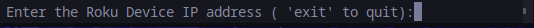

# CLI Roku Remote

**A command-line Roku remote for  any CLI environment including Termux for Android.**


## Introduction

CLI Roku Remote is a Python-based command-line application that allows you to control your Roku device right from your terminal. This application is built to be used in any command line ( I use it with Termux becuase my first instinct is to go for my phone to control my roku device.) With this remote, you can easily navigate, control playback, and launch Roku apps on your Roku device.

## Prerequisites

Before using the CLI Roku Remote, make sure you have the following prerequisites installed:

1.Python (usually pre-installed.)
```
python --verion

```

3. A text editor (e.g., Nano or Vim)

## Installation

1. Clone the repository to your local machine or download the source code.

   ```bash
   git clone https://github.com/alee97422/CLI-roku-remote.git

2. cd to the project directory.

```
cd CLI-roku-remote

```

## Usage

1. Run the CLI Roku Remote
```
python app.py

```

2. You will then be prompted to enter the roku IP address(I've added space to keep track of a few of  your frequent devices you just have to change the asterisks to the IP address). You can find your Roku's IP address in the Roku settings or by using nmap




3. To control your Roku device, you can use the following commands:

- `home`: Go to the Roku home screen.
- `up`: Navigate up.
- `down`: Navigate down.
- `left`: Navigate left.
- `right`: Navigate right.
- `select`: Select the currently highlighted item.
- `back`: Go back.
- `play`: Play or pause.
- `forward`: Fast forward.
- `reverse`: Rewind.
- `netflix`: Launch the Netflix app.
- `Peacock`: Launch the Peacock app.
- `exit`: Exit the CLI Roku Remote.

4. To return to the IP address input, you can use the `back` command.

5. To exit the application, you can use the `exit` command.


Thank you for your interest!!!! 
Feel free to submit any contributions!